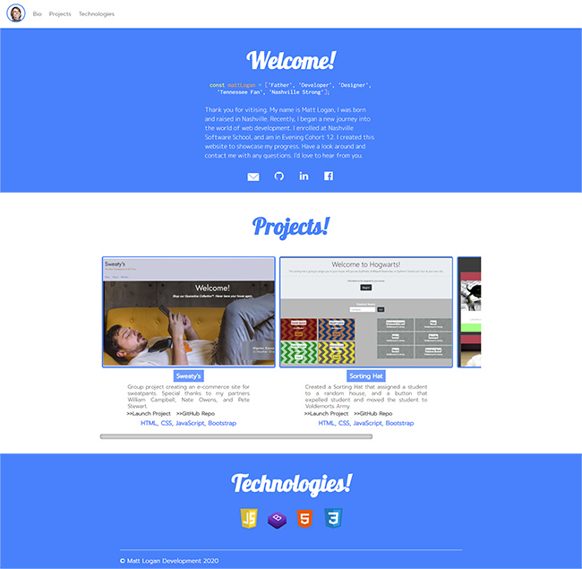

# NSS E12 Project - Personal Bio Site

## Description:
The objective of this project is to create a personal portfolio using technologies we will learn over the next 6 months to showcase our progress as a developer. The project currently uses HTML, CSS, and JavaScript. There is a bio section, a project section that shows my work, and a technologies section. 

## Screenshots:
##### Main View:

##### Scroll Through Projects:

##### Responsive Design:

## How To Run:
>This site is deployed at [https://logandevelopment.io](https://logandevelopment.io)
